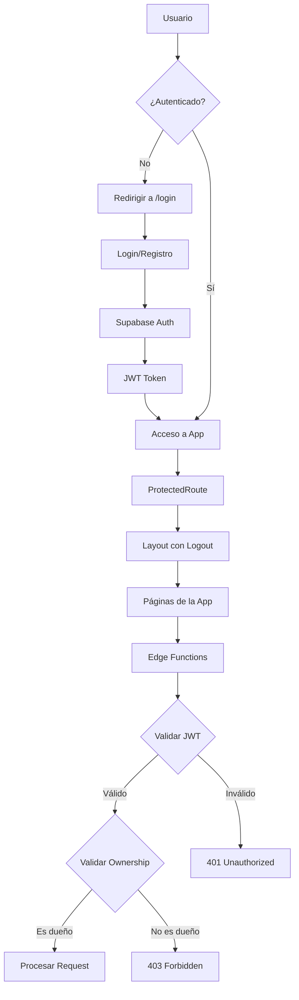

# 🛡️ SEGURIDAD RESTAURADA - Autenticación Completa

## ✅ Estado Actual

La aplicación ahora tiene **seguridad completa** implementada:

### **1. Autenticación de Usuarios** 🔐
- ✅ Login/Registro obligatorio
- ✅ JWT tokens para validación
- ✅ Sesiones seguras con Supabase Auth
- ✅ Cierre de sesión funcional

### **2. Row Level Security (RLS)** 🔒
- ✅ Aislamiento completo de datos por usuario
- ✅ Cada usuario solo ve sus propios jobs
- ✅ Mensajes accesibles solo por el dueño del job
- ✅ Políticas RLS en todas las tablas

### **3. Validación en Edge Functions** ⚡
- ✅ API Key para prevenir llamadas externas
- ✅ JWT para autenticación de usuario
- ✅ Validación de ownership de jobs
- ✅ Doble capa de seguridad

### **4. Frontend Protegido** 🚧
- ✅ Rutas protegidas con ProtectedRoute
- ✅ Redirección automática a login si no autenticado
- ✅ UI de login/registro completa
- ✅ Botón de logout en header

---

## 🚨 Vulnerabilidades CORREGIDAS

| Vulnerabilidad | Estado Anterior | Estado Actual |
|----------------|-----------------|---------------|
| **Acceso público a jobs** | ❌ Cualquiera podía ver | ✅ Solo usuario dueño |
| **Modificación de datos** | ❌ Sin restricciones | ✅ Solo dueño del job |
| **Aislamiento de datos** | ❌ No existía | ✅ RLS completo |
| **Datos de clientes expuestos** | ❌ Públicos | ✅ Privados por usuario |
| **Números de teléfono** | ❌ Accesibles a todos | ✅ Solo para dueño |

---

## 📦 Archivos Creados/Modificados

### **Nuevos Archivos:**
1. `supabase/migrations/20260212300000_restore_security.sql` - Migración de seguridad
2. `src/pages/Login.tsx` - Página de autenticación
3. `src/components/ProtectedRoute.tsx` - Componente de rutas protegidas
4. `SECURITY_RESTORED.md` - Este documento

### **Archivos Modificados:**
1. `src/App.tsx` - Rutas protegidas agregadas
2. `src/pages/Preview.tsx` - user_id agregado al crear jobs
3. `src/components/Layout.tsx` - Ya tenía soporte de logout
4. `supabase/functions/_shared/api-key-validator.ts` - Validación JWT agregada
5. `supabase/functions/enqueue-messages/index.ts` - Autenticación agregada
6. `supabase/functions/process-message-queue/index.ts` - Autenticación agregada
7. `supabase/config.toml` - verify_jwt habilitado

---

## 🚀 DEPLOYMENT - PASOS CRÍTICOS

### **⚠️ IMPORTANTE: Ejecutar en este orden**

#### **Paso 1: Aplicar Migración de Base de Datos** 📊

```bash
cd C:\Users\sebas\Desktop\whatsapp-sender-pro
supabase db push
```

Esto aplicará la migración `20260212300000_restore_security.sql` que:
- Elimina políticas inseguras
- Crea políticas RLS seguras
- Habilita autenticación en todas las tablas

#### **Paso 2: Desplegar Edge Functions Actualizadas** ⚡

```bash
supabase functions deploy enqueue-messages
supabase functions deploy process-message-queue
```

#### **Paso 3: Desplegar Frontend a Vercel** 🌐

```bash
git add .
git commit -m "feat: restore authentication and security"
git push origin main
```

Vercel desplegará automáticamente.

#### **Paso 4: Crear Primer Usuario** 👤

1. Ir a tu app desplegada
2. Hacer clic en "Registrarse"
3. Crear cuenta con email y password
4. Verificar email (Supabase envía automáticamente)

---

## 🔐 Políticas RLS Implementadas

### **Tabla `jobs`**

```sql
-- Solo ver jobs propios
CREATE POLICY "Users can view their own jobs"
  ON public.jobs FOR SELECT
  USING (auth.uid() = user_id);

-- Solo crear jobs con tu user_id
CREATE POLICY "Users can insert their own jobs"
  ON public.jobs FOR INSERT
  WITH CHECK (auth.uid() = user_id);

-- Solo actualizar jobs propios
CREATE POLICY "Users can update their own jobs"
  ON public.jobs FOR UPDATE
  USING (auth.uid() = user_id)
  WITH CHECK (auth.uid() = user_id);

-- Solo eliminar jobs propios
CREATE POLICY "Users can delete their own jobs"
  ON public.jobs FOR DELETE
  USING (auth.uid() = user_id);
```

### **Tabla `sent_messages`**

```sql
-- Solo ver mensajes de jobs propios
CREATE POLICY "Users can view messages from their own jobs"
  ON public.sent_messages FOR SELECT
  USING (
    EXISTS (
      SELECT 1 FROM public.jobs
      WHERE jobs.id = sent_messages.job_id
      AND jobs.user_id = auth.uid()
    )
  );
```

### **Tabla `message_queue`**

Similar a `sent_messages`, todas las operaciones validadas mediante ownership del job.

---

## 🧪 Testing de Seguridad

### **Test 1: Aislamiento de Datos**

1. Crear usuario A y subir un archivo
2. Crear usuario B y subir otro archivo
3. Usuario A NO debe ver jobs de Usuario B
4. Usuario B NO debe ver jobs de Usuario A

### **Test 2: Validación de Ownership**

1. Usuario A crea job con ID `abc-123`
2. Usuario B intenta acceder a `/history/abc-123`
3. Debe ser bloqueado (403 Forbidden)

### **Test 3: Edge Functions**

1. Intentar llamar Edge Function sin JWT → 401 Unauthorized
2. Intentar procesar job de otro usuario → 403 Forbidden

---

## 📚 Flujo de Autenticación



---

## ⚠️ Consideraciones Importantes

### **1. Datos Existentes** 📊

Si ya tenías datos en la BD:
- Los jobs sin `user_id` quedarán huérfanos
- La migración intenta asignarles un UUID dummy
- Revisa y limpia datos antiguos manualmente

### **2. Usuarios Existentes** 👥

- Si usabas la app sin login, necesitas crear cuentas
- Todos los usuarios deben registrarse

### **3. API Key** 🔑

- Mantén la API Key actual
- Es una capa adicional de seguridad
- No la expongas públicamente

---

## 🎯 Verificación Final

Checklist de seguridad:

- [ ] Migración aplicada (`supabase db push`)
- [ ] Edge Functions desplegadas
- [ ] Frontend desplegado en Vercel
- [ ] Primer usuario creado y probado
- [ ] Login funciona correctamente
- [ ] Logout funciona correctamente
- [ ] Jobs aislados por usuario
- [ ] No se pueden ver jobs de otros usuarios
- [ ] Edge Functions validan JWT
- [ ] Edge Functions validan ownership

---

## 📞 Soporte

Si encuentras problemas:

1. Revisar logs de Supabase: `supabase functions logs <function-name>`
2. Verificar políticas RLS en Supabase Dashboard
3. Revisar consola del navegador para errores de auth

---

## ✅ **¡SEGURIDAD RESTAURADA!**

Tu aplicación ahora es segura y cumple con:
- ✅ Autenticación obligatoria
- ✅ Aislamiento de datos
- ✅ Protección contra acceso no autorizado
- ✅ Privacidad de datos de clientes

**Última actualización:** 2026-02-12
**Status:** 🟢 SEGURO

